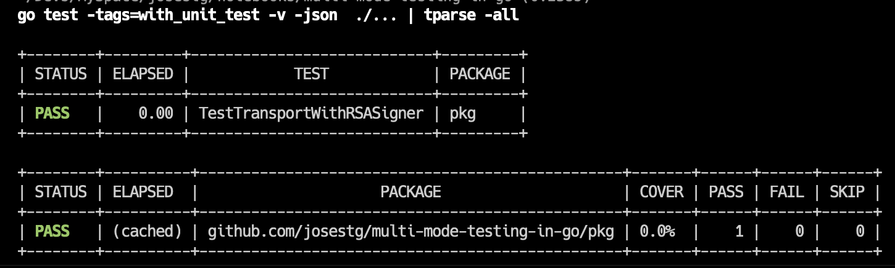
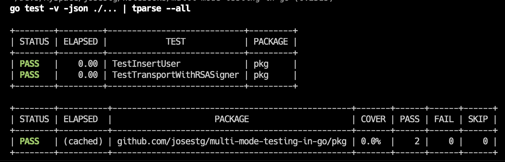
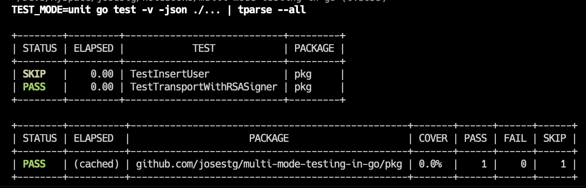
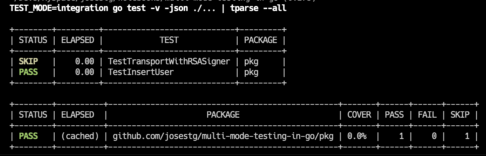

# Multi Mode Testing in Go

## Problem

Dalam project yang sedang saya kerjakan saat ini, saya membutuhkan sebuah cara untuk dapat menjalankan test berdasarkan kondisi. Pada kasus saya saat ini, saya ingin membuat unit-testing dan integration dapat berjalan secara terpisah ataupun bersamaan ditentukan pada saat menjalankan test.

## Solution I: Menggunakan Build Tags

Pada dasarnya file testing di go sudah menggunakan Build Tags, yaitu menggunakan suffix `_test` untuk setiap nama file test. Dengan menggunakan suffix tersebut, secara otomatis go akan menganggapnya sebagai test file dan tidak akan diikutsertakan pada proses kompilasi binary aplikasi.

Permasalahannya adalah semua file test, baik itu untuk unit test dan integration memiliki suffix `_test`. Untungnya di Go kita bisa tambahkan custom suffix didalam source code nya secara langsung, yaitu dengan menambahkan komentar `//+build <nama tag yang kita mau>` atau `//go:build <nama tag yang kita mau>` (untuk versi 1.17+) di bagian paling atas source code.

1. Integration Testing

```go
//go:build with_integration_test

package pkg_test

import (
	"testing"
)


func InsertUser(t *testing.T) {
    t.Log("integration test: InsertUser")
}
```

2. Unit Testing

```go
//go:build with_unit_test

package pkg_test

import (
	"testing"
)


func TestTransportWithRSASigner(t *testing.T) {
    t.Log("unit test: TransportWithRSASigner")
}
```

Dengan menggunakan build tags `with_unit_test` dan `with_integration_test`, sekarang kita bisa menargetkan test mana yang akan dikta jalankan. Caranya dengan menggunakan flag `-tags`.

1. Menjalankan unit testing

```bash
go test -tags=with_unit_test -v ./...
```

Contoh:

```bash
go test -tags=with_unit_test -v  ./...
?   	github.com/josestg/multi-mode-testing-in-go	[no test files]
=== RUN   TestTransportWithRSASigner
    transport_test.go:11: unit test: TransportWithRSASigner
--- PASS: TestTransportWithRSASigner (0.00s)
PASS
ok  	github.com/josestg/multi-mode-testing-in-go/pkg	(cached)
```

2. Menjalankan integration testing

```bash
go test -tags=with_integration_test -v ./...
```

Contoh:

```bash
go test -tags=with_integration_test -v  ./...
?   	github.com/josestg/multi-mode-testing-in-go	[no test files]
=== RUN   TestInsertUser
    repository_test.go:11: integration test: InsertUser
--- PASS: TestInsertUser (0.00s)
PASS
ok  	github.com/josestg/multi-mode-testing-in-go/pkg	(cached)
```

3. Menjalankan keduanya

```bash
go test -tags=with_unit_test,with_integration_test -v ./...
```

Contoh:

```bash

go test -tags=with_unit_test,with_integration_test -v  ./...
?   	github.com/josestg/multi-mode-testing-in-go	[no test files]
=== RUN   TestInsertUser
    repository_test.go:11: integration test: InsertUser
--- PASS: TestInsertUser (0.00s)
=== RUN   TestTransportWithRSASigner
    transport_test.go:11: unit test: TransportWithRSASigner
--- PASS: TestTransportWithRSASigner (0.00s)
PASS
ok  	github.com/josestg/multi-mode-testing-in-go/pkg	0.836s
```

#### References:

1. https://dave.cheney.net/2013/10/12/how-to-use-conditional-compilation-with-the-go-build-tool

---

## Solution II: Menggunakan `t.Skip()` dan `os.Getenv()`

Dengan menggunakan build tags, sebenarnya sudah dapat mencapai kebutuhan saya. Tetapi, semakin sering menggunakannya, saya menemukan kesulitan. Yaitu, sulit untuk melihat apa saja build tags yang dimiliki serta sering typos ketika menulisnya. Lain lagi, bagi saya yang menggunakan IDE harus melakukan melakukan sedikit konfigurasi dengan di IDE agar bisa menjalankan test langsung dari IDE.

Tetapi masalah utamanya adalah, saya tidak bisa meilihat ada berapa test yang tidak diikutsertakan. Mungkin biar lebih jelas, saya akan menggunakan sebuah pakckage agar tampilan test lebih informatif.

1. Install `tparse`. [Github](https://github.com/mfridman/tparse)

```bash
go install github.com/mfridman/tparse@latest
```

2. Kita akan gunakan tags `-json` untuk membuat hasil test menjadi JSON dan kemudian hasilnya di `pipe` ke `tparse`.

```
go test -tags=with_unit_test -v -json  ./... | tparse
```



Perhatikan kita menggunakan build tags `with_unit_test`, kita bisa melihat bahwa 1 test yang dijalankan. Sementara sebenarnya kita memiliki test lain yaitu yang memiliki build tags `with_integration_test`. Target saya berikutnya adalah untuk menampilkan ada berapa banyak test yang tidak kita jalankan (ada berapa banyak test yang tidak memiliki build tags `with_unit_test`).

Cara yang terpikirkan oleh saya saat ini adalah dengan memanfaatkan `t.Skip()` dan `os.Getenv()`.

Disini saya menambahkan sebuah fungsi helper.

```go
package pkg

import (
	"os"
	"testing"
)

const (
	ModeAll = "all"
	ModeUnit = "unit"
	ModeIntegration = "integration"
)

func RunTestWhen(t *testing.T, mode string) {
	envMode := os.Getenv("TEST_MODE")
	if envMode == "" || envMode == ModeAll {
		return
	}

	if envMode != mode {
		t.Skip()
	}
}
```

Kemudian menggunakan fungsi `RunTestWhen()` di source testing.

1. Integration Testing

```go
package pkg_test

import (
	"testing"
	"github.com/josestg/multi-mode-testing-in-go/pkg"
)


func TestInsertUser(t *testing.T) {
	pkg.RunTestWhen(t, pkg.ModeIntegration)
    t.Log("integration test: InsertUser")
}
```

2. Unit Testing

```go
package pkg_test

import (
	"testing"
	"github.com/josestg/multi-mode-testing-in-go/pkg"
)


func TestTransportWithRSASigner(t *testing.T) {
	pkg.RunTestWhen(t, pkg.ModeUnit)
    t.Log("unit test: TransportWithRSASigner")
}
```

untuk menjalankan nya bisa menggunakan bantuan ENV sistem operasi.

1. Ketika tidak menggunakan tambahan ENV maka, kedua test akan dijalankan. Dalam kasus ini saya jadikan ini sebagai kondisi default.



2. Hanya menjalankan Unit Testing.



3. Hanya menjalankan Integration Testing.



Dengan menggunakan cara ini, sekarang saya bisa melihat informasi test mana saja yang dijalankan dan test mana saja yang tidak dijalankan.
